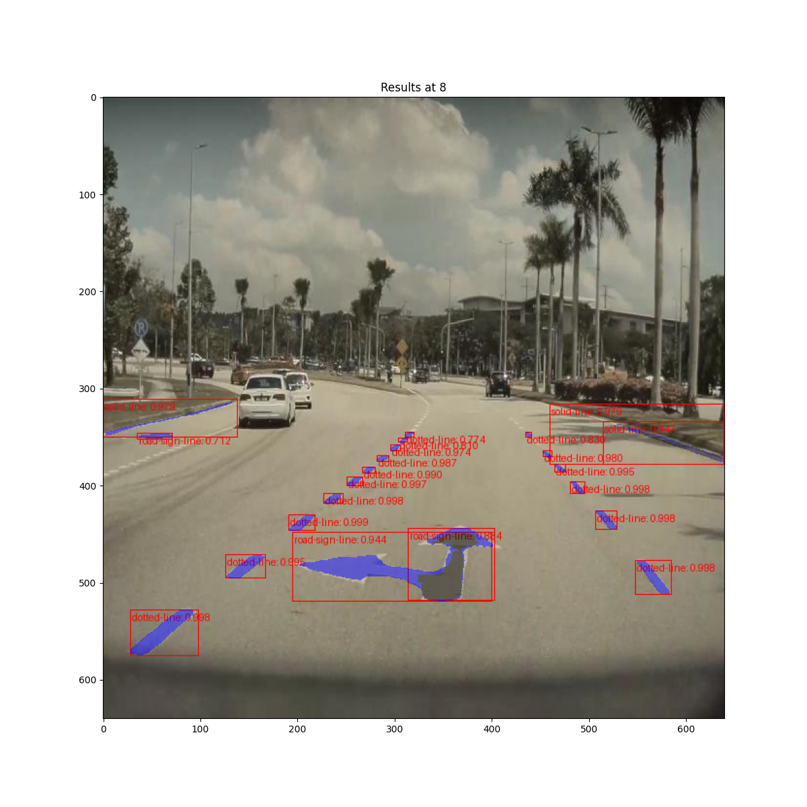
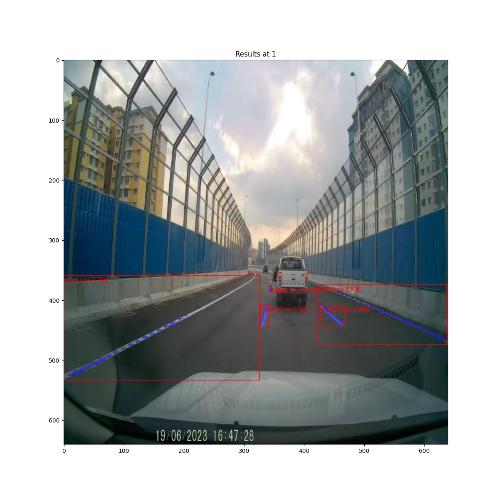
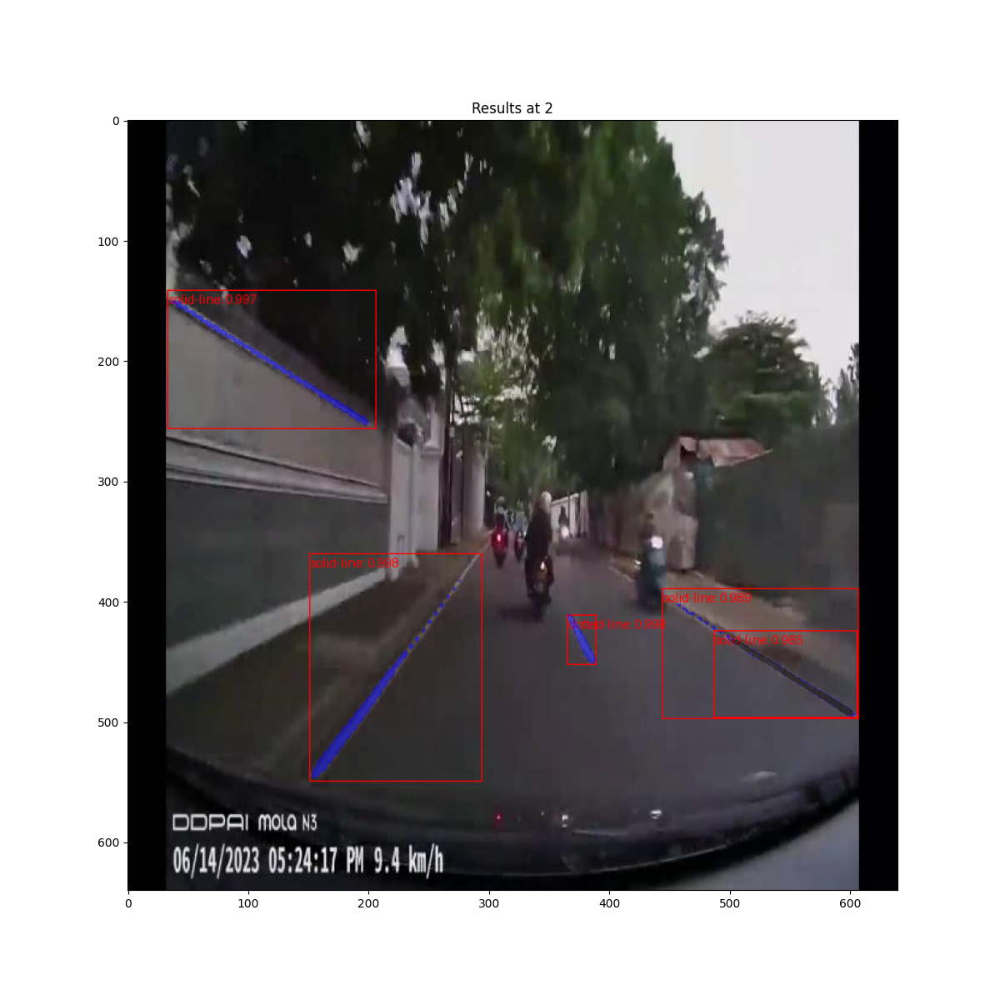
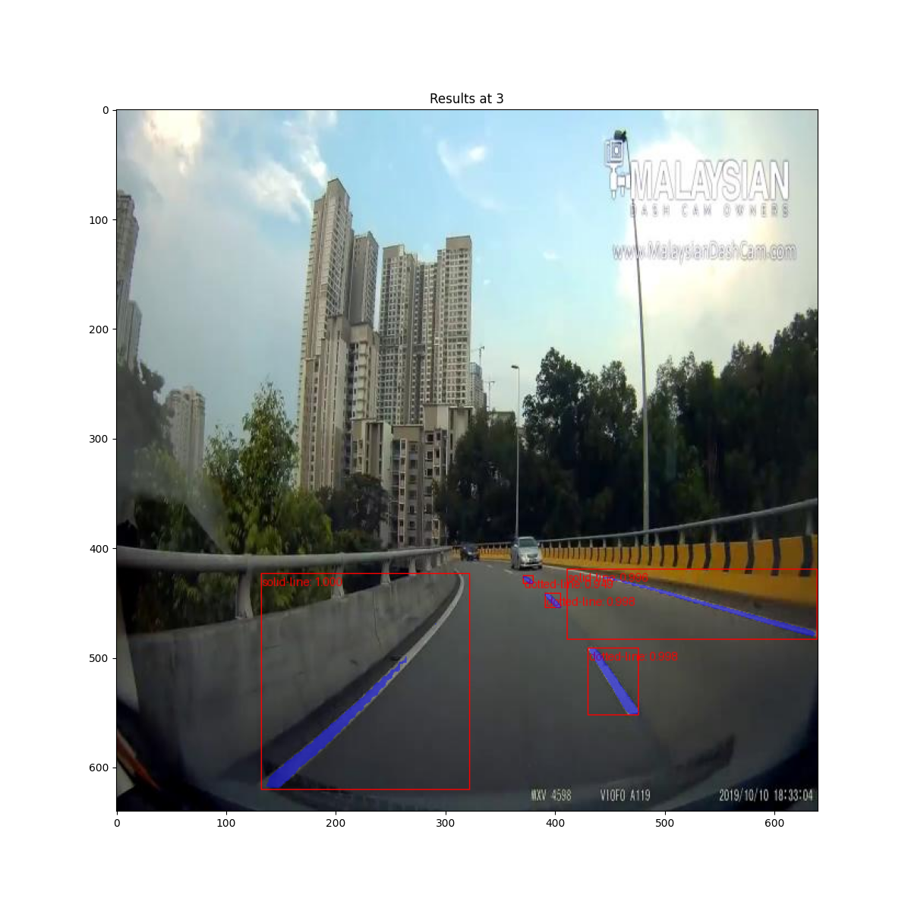
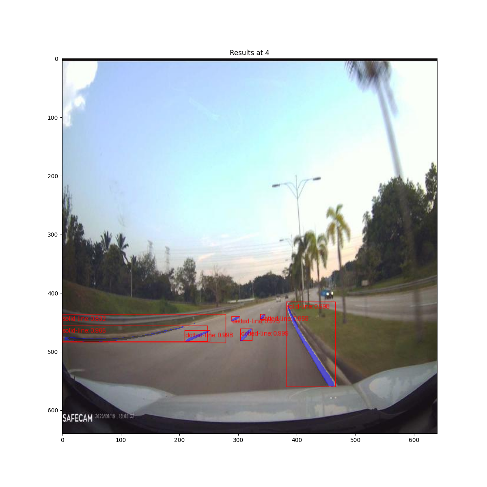

# Road Line Instance Segmentation

A Mask RCNN pytorch implementation for segmenting road lines and markings. This uses a standard RCNN in pytorch.

The data for this can be found [here](https://www.kaggle.com/datasets/sovitrath/road-lane-instance-segmentation)

## Examples

